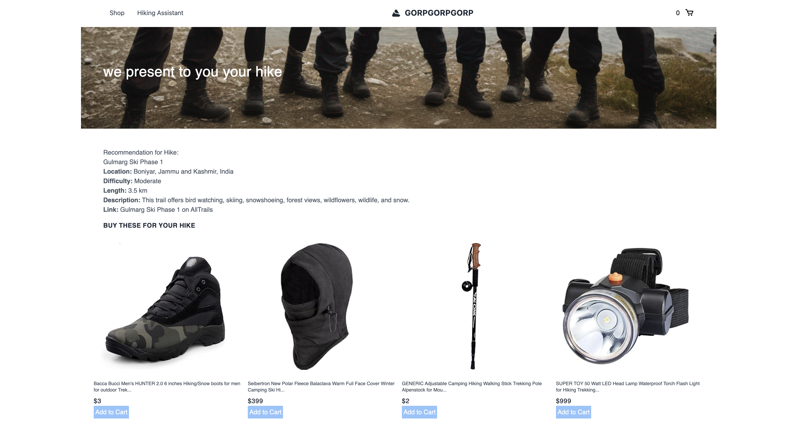

# An eCommerce application with Vector Search and RAG built with [Weaviate](https://weaviate.io/), [Nuxt.js](https://nuxt.com/modules/webhook-validators), [Cohere](https://cohere.com/) and [Open AI](https://openai.com/). 

This repo should help get you started developing RAG Applications for eCommerce with Weaviate and Nuxt.js.



## Installation 

1. Clone the repo with the following command
    ```bash
    git clone https://github.com/weaviate-tutorials/nuxt-ecommerce-rag
    ```

2. Install the necessary project dependencies with the following command
    ```bash
    yarn install
    ```
3. Create a Weaviate instance on Weaviate Cloud Services as described in [this guide](https://weaviate.io/developers/weaviate/quickstart#step-2-create-an-instance)

4. Create a `.env` file and add the following keys
    - your Open AI API key as `NUXT_OPENAI_API_KEY` (you can get this in your [Open AI settings](https://platform.openai.com/account/api-keys))
    - your Cohere API key as `NUXT_COHERE_API_KEY` (you can get this in your [Cohere settings](https://dashboard.cohere.com/api-keys))
    - your Weaviate API key as `NUXT_WEAVIATE_READ_KEY` (you can get this in your [Weaviate dashboard](https://console.weaviate.cloud/dashboard) under sandbox details)
    - your Weaviate Admin API key as `NUXT_WEAVIATE_ADMIN_KEY` (you can get this in your [Weaviate dashboard](https://console.weaviate.cloud/dashboard) under sandbox details)
    - your Weaviate host URL as `NUXT_WEAVIATE_HOST_URL` (you can get this in your [Weaviate dashboard](https://console.weaviate.cloud/dashboard) under sandbox details)


5. Import your data and initialize your collections by uncommenting the last three lines in `import/simple.ts` and then running the following command

   ```bash
   yarn run import-data 
   ``` 
5. Start your Nuxt.js app with the following command
    ```bash
    yarn dev
    ```

6. Search away!!


## 📚 Resources
Learn more about Weaviate applications
- [101T Work with: Text data in JavaScript](https://weaviate.io/developers/academy/js/starter_text_data)
- [Weaviate Generative Search](https://weaviate.io/developers/weaviate/modules/reader-generator-modules/generative-openai)
- [Vector Search](https://weaviate.io/developers/weaviate/search/similarity)
  
## 🤷🏾‍♂️ Troubleshooting
- Check out the [Weaviate Docs](https://weaviate.io/developers/weaviate)
- Open an [Issue](https://github.com/malgamves/vue-vector-search-demo/issues/new)
   
